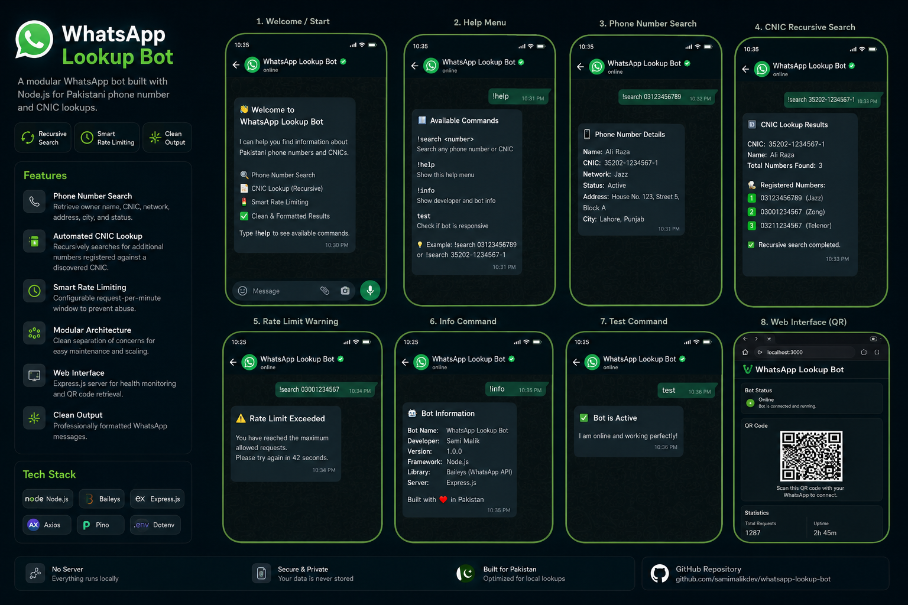

<div align="center">


<br />
<br />

<h1>WhatsApp Phone & CNIC Lookup Bot</h1>

<p><strong>A modular WhatsApp bot built with Node.js for Pakistani phone number and CNIC lookups.</strong></p>

<p><em>Recursive search. Smart rate limiting. Clean output.</em></p>

<br />

[Features](#features) • [Tech Stack](#tech-stack) • [Project Structure](#project-structure) • [Getting Started](#getting-started) • [Commands](#commands)

<br />

</div>

---

## Features

| | Feature | Description |
|-|---------|-------------|
| | **Phone Number Search** | Retrieve owner name, CNIC, network, address, city, and status |
| | **Automated CNIC Lookup** | Recursively searches for additional numbers registered against a discovered CNIC |
| | **Smart Rate Limiting** | Configurable request-per-minute window to prevent abuse |
| | **Modular Architecture** | Clean separation of concerns for easy maintenance and scaling |
| | **Web Interface** | Express.js server for health monitoring and QR code retrieval |
| | **Clean Output** | Professionally formatted WhatsApp messages |
| | **Blocked Numbers** | Built-in blacklist for restricted search entities |

---

## Tech Stack

| Category | Technology |
|----------|------------|
| **Runtime** | Node.js (ES Modules) |
| **WhatsApp API** | @whiskeysockets/baileys |
| **Web Server** | Express.js |
| **HTTP Client** | Axios |
| **Logging** | Pino |
| **Environment** | Dotenv |

---

## Project Structure

```text
src/
├── config/        # Constants and API configurations
├── handlers/      # Message and command logic
├── services/      # External API integrations
├── utils/         # Validation, formatting, and rate limiting
├── bot.js         # WhatsApp connection and event logic
├── server.js      # Express server setup
└── index.js       # Entry point
```

---

## Getting Started

### Prerequisites

- [Node.js](https://nodejs.org/) `>=18.x`
- An active WhatsApp account for bot authentication

---

### 1. Clone the repository

```bash
git clone https://github.com/samimalikdev/whatsapp-lookup-bot.git
cd whatsapp-lookup-bot
```

### 2. Configure environment variables

Create a `.env` file in the root directory:

```env
PORT=3000
NEW=your_api_endpoint_url
```

### 3. Install dependencies

```bash
npm install
```

### 4. Start the bot

```bash
npm run dev
```

### 5. Authenticate

Scan the QR code generated in the terminal or visit:

```
http://localhost:3000/qr
```

---

## Commands

| Command | Description |
|---------|-------------|
| `!search <number>` | Lookup details for a phone number or CNIC |
| `!help` | Display available commands and search formats |
| `!info` | Show developer and bot information |
| `test` | Verify if the bot is responsive |

---

## Demo

### Full App Walkthrough

<div align="center">
  <a href="https://youtube.com/shorts/8sCP5mNt91Y?feature=share">
    
  </a>
  <p><b>Click to watch the bot in action</b></p>
  <p><i>Phone number lookup, CNIC search, recursive results and rate limiting — all in action.</i></p>
</div>

<p align="center">
  
</p>

---

## License

Distributed under the MIT License. See [`LICENSE`](LICENSE) for details.

---

<div align="center">

Built with focus on clean, high-performance backend systems.

If this helped you, drop a star — it means a lot.

</div>
